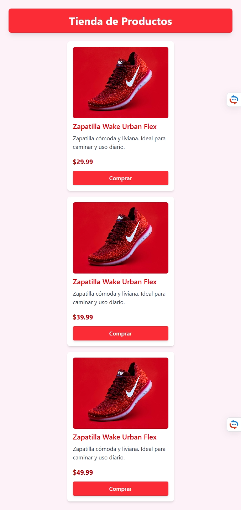
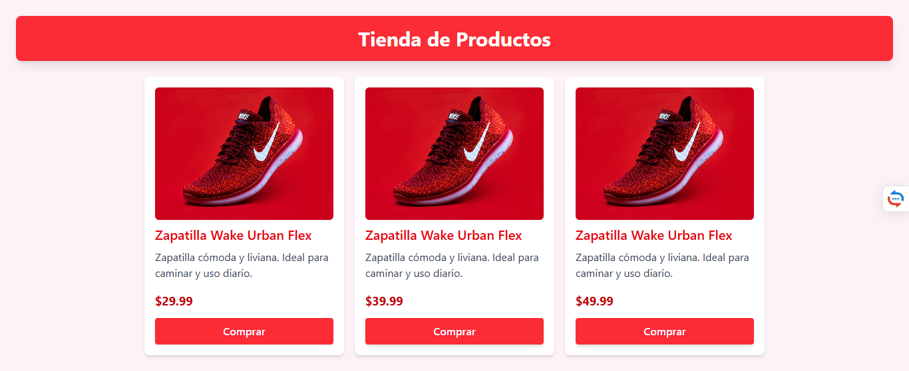

# 🛍️ Tienda de Productos - Tarjetas con Tailwind CSS

Este proyecto es una práctica de diseño de tarjetas de productos utilizando **Tailwind CSS**. La interfaz presenta una pequeña tienda con productos ficticios y un diseño responsive adaptable a pantallas móviles y de escritorio.

## 📸 Capturas de pantalla

### 💻 Versión Desktop
 

### 📱 Versión Móvil / Tablet

## 💡 Características

- Diseño responsivo (mobile-first)
- Componentes estilizados con Tailwind CSS
- Estructura limpia y reutilizable
- Tarjetas con imagen, nombre, descripción, precio y botón de compra.

## 🧰 Tecnologías utilizadas

- HTML5
- Tailwind CSS

## 📁 Estructura del proyecto

